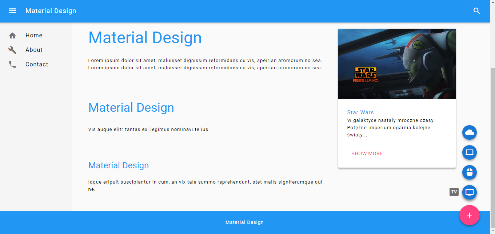

# Material Design Decorator

Material Design Decorator can help you style your HTML documents with [Google's Material Design guidelines](https://material.io/guidelines/). This is a lightweight solution - styling runs automatically after importing only two files and you don't need to ingerate in your HTML document structure (like in case of [MUI](https://www.muicss.com/) or [Materialize](http://materializecss.com/)).

## Usage

You can use this project in two styles:

Light
```html
    <link href="style/light_style.css" rel="stylesheet" type="text/css" />
    <script src="js/script.js"></script>
```

Dark
```html
    <link href="style/dark_style.css" rel="stylesheet" type="text/css" />
    <script src="js/script.js"></script>
```

## Mapping HTML5 on Material Design

Table shows main HTML5 tags with mapping on Google Material Design's elements.

HTML5 | Material Design
:--------- | :-----
```<header>``` | Material Design's header that shrinks after scrolling web page.
```<nav>``` | Main navigation, located on the left side of the page.
```<main>``` | Represents main content of page, consists of sections and articles.
```<aside>``` | Located on the right side of the page. If contains an anchor with images and header or paragraph, it'll map to Material Design's card.
```<footer>``` | Material Design's footer, placed at the bottom of the page.
```<details>``` | It has a style of Material Design's card.
```<button>``` | By default, it is mapped to flat button. If it's a direct child of the main tag, it'll convert to floating action button. If it's placed on the form, it'll map to raised button.
```<section>```, ```<article>``` | Default margins are specified for them, which provide the appropriate distance from their headers.
```<h1>```, ```<h2>```, ```<h3>```, ```<h4>```, ```<h5>```, ```<h6>``` | Their size and thickness is consistent with Material Design guidelines for typography.
```<label></label><input type=text>```  | Material Design's text field with a label.
```<input type="checkbox" id="check" /> <label for="check"></label>``` | Material Design's checkbox with a label.
```<input type="radio" id="foo" name="radio-group"/> <label for="foo"></label>``` | Material Design's radio button with a label.
```<table>``` | Material Design's data table.

## Example

For example, this code

```html
<!doctype html>
<html>

<head>
    <title>Material Design</title>
    <meta charset="utf-8" />

    <!-- Material Icons -->
    <link href="https://fonts.googleapis.com/icon?family=Material+Icons" rel="stylesheet" />

    <!-- Material Design Decorator -->
    <link href="style/light_style.css" rel="stylesheet" type="text/css" id="pagestyle" />
    <script src="js/script.js"></script>
</head>

<body>

    <header>
        <nav>
            <a><i class="material-icons">dehaze</i></a>
            <a><i class="material-icons">search</i></a>
        </nav>
    </header>

    <nav>
        <ul>
            <li><a href="#"><i class="material-icons">home</i>Home</a></li>
            <li><a href="#"><i class="material-icons">build</i>About</a></li>
            <li><a href="#"><i class="material-icons">phone</i>Contact</a></li>
        </ul>
    </nav>

    <main>
        <h1>Material Design</h1>
        <p>Lorem ipsum dolor sit amet, maluisset dignissim reformidans cu vis, apeirian atomorum no sea. Lorem ipsum dolor sit amet, maluisset dignissim reformidans cu vis, apeirian atomorum no sea.</p>
        <section>
            <h2>Material Design</h2>
            <p>Vis augue elitr tantas ex, legimus nominavi te ius.</p>
            <article>
                <h3>Material Design</h3>
                <p>Idque eripuit suscipiantur in cum, an vix tale summo reprehendunt, stet malis signiferumque qui ne.</p>
            </article>
        </section>

        <div>
            <button><i class="material-icons" tooltip="Cloud">cloud</i></button>
            <button><i class="material-icons" tooltip="Computer">computer</i></button>
            <button><i class="material-icons" tooltip="Mouse">mouse</i></button>
            <button><i class="material-icons" tooltip="TV">tv</i></button>
            <button><i class="material-icons" tooltip="Add">add</i></button>
        </div>
    </main>

    <aside>
        <a href="https://pl.wikipedia.org/wiki/Star_Wars:_Rebelianci" target="blank">
            
            <div>
                <h6>Star Wars</h6>
                <p>W galaktyce nastały mroczne czasy. Potężne Imperium ogarnia kolejne światy...</p>
                <button>Show more</button>
            </div>
        </a>
    </aside>

    <footer>Material Design</footer>
</body>

</html>
```

produce:


## License

This project is licensed under the GNU General Public License v3.0. See the [LICENSE](LICENSE) file for details.

## Author

Patrycja Karpińska [@karppinska](https://twitter.com/karppinska)
